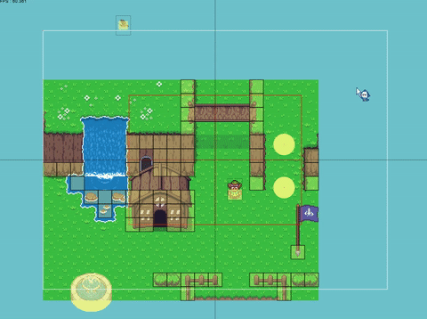
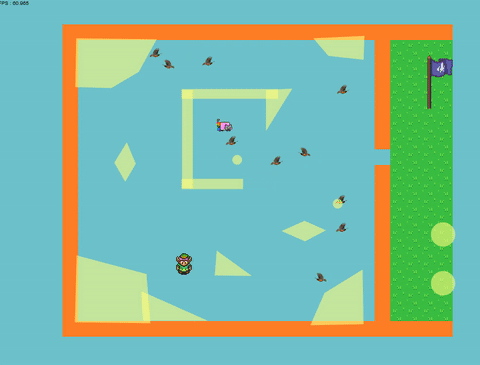
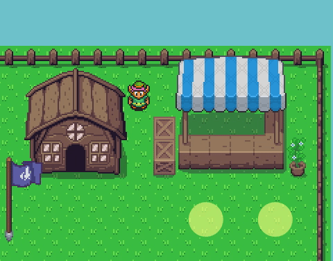
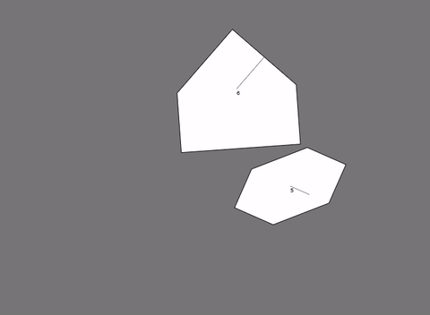
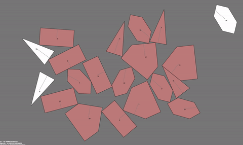
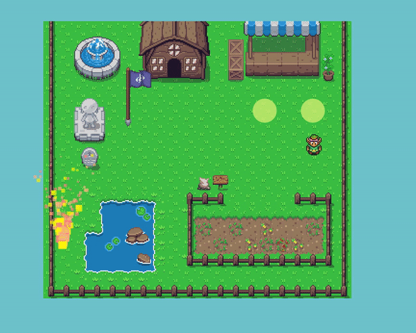
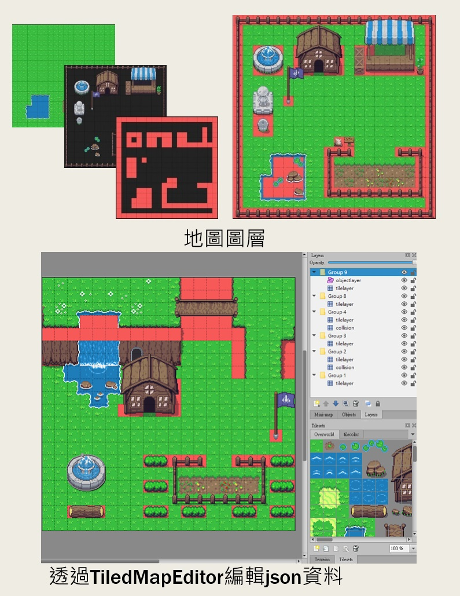
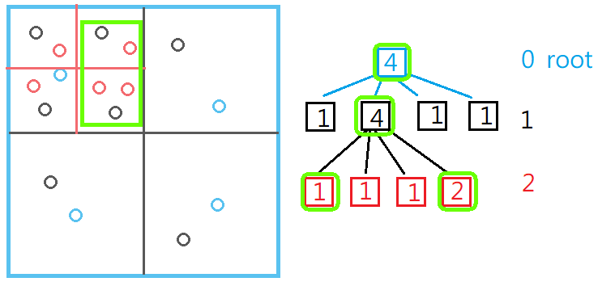
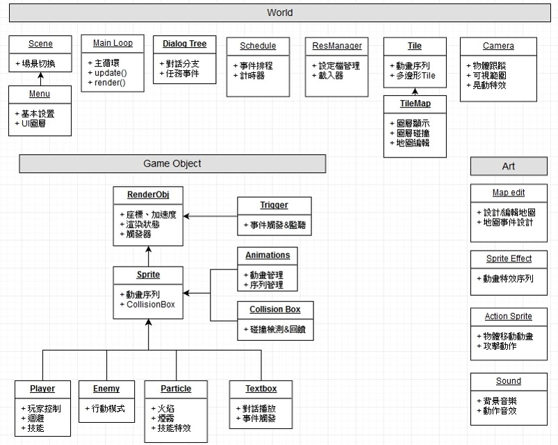

# 從零開始的基礎RPG框架

[Sourcecode](https://github.com/beadcaptain/2DGameNoneName) : 運行SourceCode時將此目錄丟到Apache中即可

## 遊戲Demo連結

操作方式: 上下左右、空白鍵衝刺、 Z 攻擊、X 遠程、T 開啟Debug、WASD移動視角、R 重製視角

- [ver01(game)](https://davidhsu666.com/downloads/GameEngineT/engineDemo/game) :
可以讀取地圖的第一版
- [基礎展示(game0)](https://davidhsu666.com/downloads/GameEngineT/engineDemo/game0) :
用簡易的基礎地圖展示所有功能
- [上下坡事件觸發器(game2)](https://davidhsu666.com/downloads/GameEngineT/engineDemo/game2) :

- [完整的場景(gameshow1)](https://davidhsu666.com/downloads/GameEngineT/engineDemo/gameshow1) :

- [多邊形碰撞場景(gameshow2)](https://davidhsu666.com/downloads/GameEngineT/engineDemo/gameshow2) :



## 目前進度

- 攝影機
- 動態碰撞盒
- 事件觸發器
- 自訂地圖存取
- Debug(圖層、碰撞層顯示)


## 攝影機、Debug

- 加入Debug功能方便測試
- 只顯示視線範圍內的物件
- 渲染物件的動態圖層顯示
- 可隨意設定攝影機的追蹤範圍與目標，例如視角綁定在小鳥身上





## 碰撞盒:多邊形碰撞與回饋

[http://davidhsu666.com/archives/gamecollisiondetection/](http://davidhsu666.com/archives/gamecollisiondetection/)

透過分離軸定理，解決普通AABB碰撞檢測無法處裡的多邊形與圓形

建立自製碰撞函示庫，並透過最小穿透量來處理物體間的分離，將碰撞盒整合至物體中並加以應用





## 動態碰撞盒、敵人移動、事件觸發器

-透過動態碰撞盒處理揮砍的動作

-加入狀態切換管理，攻擊開始->攻擊中->攻擊結束

- 透過事件觸發器處理各式地圖事件
- 像是地圖上下坡，需要切換碰撞層，與NPC對話區域的觸發器，或是走斜坡時會被減速等等




## 地圖編輯與讀取

透過json檔案生成對應的地圖物件，如動畫、碰撞、物件等

依照編輯時的圖層，建立對應的顯示順序

而每個Group相隔10的Z-index，圖中Group2、Group4分別有橋下與橋上的碰撞層，所以只要更改人物的Z-index即可實現上下區域的碰撞切換

並支援自訂多邊形，圖中左下角的噴水池為自訂多邊形所包成的碰撞體，基礎展示(game0)中的石頭也是



## 大致運行方式

所有物體皆繼承自Entity :
```js
Entity:
{
    name: "monster"                            // 此Entity的名稱或類別
    pos: { x: 0, y: 0 },
    vel: { x: 0, y: 0 },
    acc: { x: 0, y: 0 },
    zindex: 20,
    collider: {                         // 碰撞盒範圍，不規則多邊形則指定相對位置頂點
        x: -15, y: -15,
        w: 30, h: 30
    },
    bounceToMap: false,                 // 是否與地圖發生向量鏡射的反彈回饋
    collisionToMap: true,               // 是否與地圖發生碰撞
    world: Worldmap,                    // 所在的地圖
    animation: {                        // 圖片的設置
        frameWidth: 44,
        frameHeight: 40,
        renderScale: 1 / 2,
        imgName: 'coin',
        speed: 15,
        action: {                       // 設定個動作的循環
            'default': '0-9',           // 可連續設置也可跳號指定
            'atk':'11,12,14,19',
            'imgMode','25'              // 靜態圖片模式
        }
    },
    survivalMode : false,               // 是否消失
    survivalTime : -1,                  // 設定存在時間
    hitActionData :{                    // 事件觸發器: 設定此Endity在更新時要和誰互動的事件
        target: [...],                  // 設定那些物體會觸發
        action: (ent1, ent2) {
            // ent1為自己、ent2為其他entity
            // 設定兩物體接觸後的處理，如碰撞分離、更改速度等等的事件觸發器
        }
    }
}
```

事件觸發器的使用，以地圖中的Tile與玩家/怪物的碰撞為例:
```js
TileEntity = {
        name: 'layerObj',
        pos: { x: 0, y: 0 },    // 設定為每塊Tile所在的位置
        collisionToMap: false,
        hitActionData: {
            parent: this,       // 觸發器的本體是誰
            target: ['player','enemy1'],    // 設定和player與enemy兩種Entity反應
            // 對target中的物體執行對應動作
            action: function (ent1, ent2) {
                // 取得自己與其他Entity的碰撞盒
                let collider1 = ent1.getCollisionBox();
                let collider2 = ent2.getCollisionBox();
                // 碰撞檢測
                if (!box2box(collider1.getBoundingBox(), collider2.getBoundingBox())) return;
                // 處理碰撞後的推擠判斷與向量鏡射
                let mtv = collider1.collideWith(collider2);
                if (mtv.axis) {
                    let v = separate(collider1, collider2, mtv)
                    ent2.pos.add(v);
                    mtvBounce(ent2, mtv)
                }
            }
        },
        drawBase: true
    }
```

當所有物體，不管是玩家、敵人、地圖Tile等，有了這個萬用的Entity後，即可透過簡單的方式更新各自Entity的循環
```js
// 程式中的主循環
function update(dt, tickcount) {
    let entities = world.gameObjs;
    // 更新所有物體
    for (const entity of entities) {
        entity.update(dt);
    }
    // 逐一檢測各Entity的事件觸發器
    for (let i = entities.length - 1; i >= 0; i--) {
        let entity = entities[i];
        let had = entity.hitActionData;
        if (!had) continue; // 此物體沒有觸發器的話就直接跳過
        for (let j = entities.length - 1; j >= 0; j--) {
            let entity2 = entities[j];
            // 判斷這個物體是否在觸發器的目標中
            if (had.target.indexOf('ALL') != -1 || had.target.indexOf(entity2.name) != -1) {
                // 執行觸發器對應的處理
                had.action(entity, entity2);
            }
        }
    }

    // 檢測那些物體該被移除
    for (let i = entities.length - 1; i >= 0; i--) {
        const entity = entities[i];
        if (entity.isDead) entities.splice(i, 1);
    }
    // camera.follow(dt, player);
    cameraControl();// 更新攝影機位置
}
```


## 碰撞效能的優化

[Quadtree_in_2d](http://davidhsu666.com/archives/quadtree_in_2d)

如果每個物體之間都進行碰撞檢測，會消耗大量的效能，複雜度來到O(N^2)

例如: 兩物體在地圖的對角線，根本不會碰撞，但還是執行檢測

透過四叉樹(Quad Tree)來進行空間上的劃分

將複雜度降低至O(N log(N))




## 架構與後續規劃

- UI選單、Menu、功能列操作
- 對話方塊與對話事件(對話樹)
- 腳本編輯與腳本觸發器，如RPG遊戲中的串場事件
- 優化物件架構，方便修改




## 檔案架構

```
├─asset
│  ├─data
│  ├─img
│  ├─sound
│  └─tile
│
│  Camera.js
│  Collision.js
│  Enemy.js
│  Entity.js
│  index.html
│  main.js
│  Particle.js
│  Player.js
│  player2.js
│  Setting.js
│  Shape.js
│  Tilemap.js
│
└─lib
        AssetLoader.js
        drawString.js
        Game.js
        SpriteAnimation.js
        stats.min.js
        utils.js
        vec.js
```